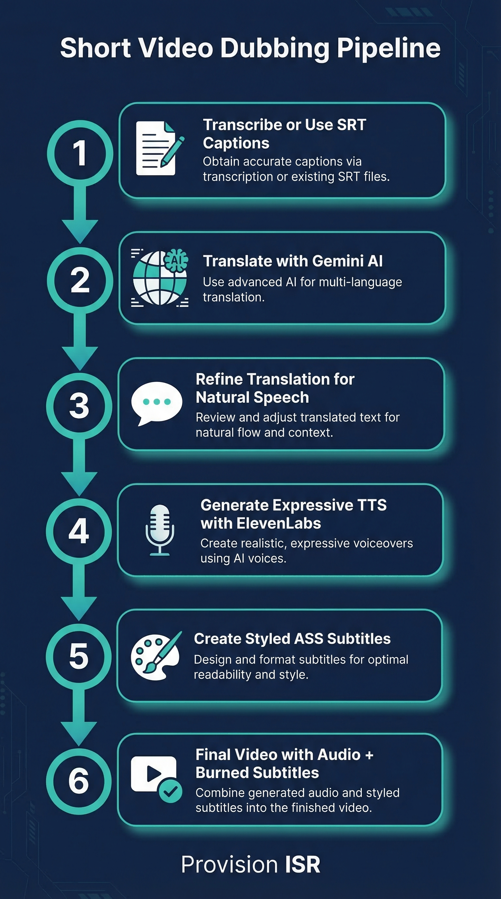

# Provision Short Video Dubbing

> Quick dubbing for short product videos with natural translations and burned-in subtitles.



## What it does

- Dubs short videos (30 seconds to 2 minutes) with natural-sounding translated narration
- Uses a two-step Gemini refinement process so translations sound spoken, not written
- Generates expressive TTS audio using ElevenLabs multilingual voices
- Creates styled ASS subtitles with customizable fonts, colors, outlines, and shadows
- Burns subtitles directly into the video alongside the dubbed audio track

## Quick Install

```bash
# Clone into Claude Code skills directory
cd ~/.claude/skills
git clone https://github.com/guyaga/provision-short-video-dubbing.git

# Restart Claude Code - the skill is auto-detected!
```

## Prerequisites

- **Python 3.10+**
- **FFmpeg** installed and on PATH ([download](https://ffmpeg.org/download.html))
- **Google Gemini API key**
- **ElevenLabs API key**

## Setup

1. Get your API keys:
   - **Google Gemini** (free): https://aistudio.google.com → Get API Key
   - **ElevenLabs**: https://elevenlabs.io → Profile → API Keys

2. Install Python packages:
   ```bash
   pip install google-genai elevenlabs pydub
   ```

3. Create a project folder and add your config:
   ```bash
   mkdir my-project && cd my-project
   mkdir -p input output
   ```

4. Create `config.json`:
   ```json
   {
     "gemini_api_key": "YOUR_GEMINI_API_KEY",
     "elevenlabs_api_key": "YOUR_ELEVENLABS_API_KEY",
     "source_video": "input/video.mp4",
     "source_srt": null,
     "target_language": "es-419",
     "target_language_name": "Latin American Spanish",
     "elevenlabs_voice_id": "YOUR_VOICE_ID",
     "elevenlabs_model": "eleven_multilingual_v2",
     "gemini_model": "gemini-3.1-pro",
     "subtitle_font": "Arial",
     "subtitle_size": 20,
     "output_dir": "output"
   }
   ```

5. Place your short video in the `input/` folder.

## Usage

Open Claude Code in your project folder and say:
```
Dub this short video to Spanish with subtitles
```

Or use the skill command:
```
/provision-short-video-dubbing
```

## How it works

1. **Transcribe** - Transcribe the video using Gemini 3.1 Pro, or parse an existing SRT file
2. **Translate** - Draft translation via Gemini to the target language
3. **Refine** - Second Gemini pass refines the translation for spoken narration: natural phrasing, conversational tone, matched pacing
4. **Generate TTS** - Create expressive audio segments with ElevenLabs
5. **Create Subtitles** - Generate styled ASS subtitles with configurable fonts, colors, and positioning
6. **Assemble** - Combine original video + dubbed audio + burned-in subtitles with FFmpeg

## Files included

| File | Description |
|------|-------------|
| `skill.md` | Skill definition for Claude Code |
| `guide_he.pdf` | Hebrew installation guide (PDF) |
| `infographic.png` | Visual pipeline diagram |
| `templates/` | Ready-to-use Python scripts |

## Templates

| File | Description |
|------|-------------|
| `templates/create_dubbed_video.py` | All-in-one script that runs the full dubbing pipeline |
| `templates/refine_translation.py` | Two-step Gemini translation refinement for natural spoken text |
| `templates/create_subtitles.py` | Styled ASS subtitle generation with font/color customization |
| `templates/config.json` | Configuration template with all available options |

## Built for

[Provision ISR](https://provisionisr.com) - Security camera and NVR solutions

## Powered by

- **Gemini 3.1 Pro** - Transcription, translation & refinement
- **ElevenLabs** - Text-to-speech generation
- **FFmpeg** - Video processing & subtitle burn-in

---

*Built with Claude Code*
